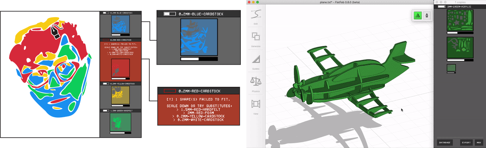
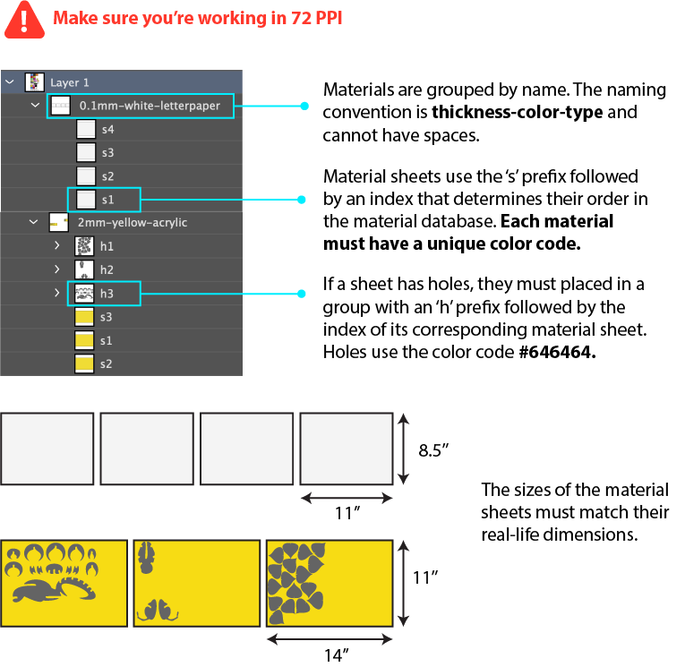

# Fabricaide

Source code for Fabricaide: Fabrication-Aware Design for 2D Cutting Machines.

### Acknowledgements 

[Fabricaide](https://hcie.csail.mit.edu/) is a system that helps designers of laser-cut objects make material-conscious design decisions and make the most of their scrap material. If you use Fabricaide as part of your research, please cite it as follows

> Fabricaide: Fabrication-Aware Design for 2D Cutting Machines.
> Ticha Sethapakdi, Daniel Anderson, Adrian Reginald Chua Sy, Stefanie Mueller.
> To Appear in The Proceedings of the 2021 ACM CHI Conference on Human Factors in Computing Systems, 2021

## Requirements

* Mac OSX 10.6+ (may work  with older versions)
* Adobe Illustrator
* The latest version  of [Processing](https://processing.org/)

## Fabricaide backend setup

* Install [Packaide](https://github.com/DanielLiamAnderson/Packaide) and follow the instructions there
* Initialize the sample material database by running `python3 initmatdb.py MatDB.svg`    

## Creating your own material database

If you want to use your own material database instead of the example one provided, you will need to modify `MatDB.svg`.
* Open MatDB.svg in a vector-editing program (e.g. Illustrator) 
* Double-check that the document resolution is 72 PPI 
* Refer to the graphic below for info on how this document should be structured:

## Processing setup

You will need the ControlP5 library and processing-java. This step only needs to be done once.
* Open Processing
* Tools > install "processing-java"
* Sketch > Import library > add library
* Search for "ControlP5" and install it

## Adobe Illustrator swatch setup

If you plan on using Fabricaide with Adobe Illustrator and do not already have the custom Illustrator swatch, you will need to do the following:
* Open up Adobe Illustrator
* Open up the Swatches panel (if it is not visible, go to Window->Swatches)
* In the lower-left hand corner of the panel select the Swatch Libraries menu, then select Other Library...
* Inside the src/FabricaideUI folder, select  the `Fabricaide.ai` file

Once you have the Fabricaide swatch imported, you can now select it in the Swatch Libraries menu, under the User Defined submenu

## Using Fabricaide with Adobe Illustrator

* Create a blank Adobe Illustrator document (use a resolution of 72 PPI and color mode of RGB)
* Double-click the `Fabricaide.command` file (it is a Terminal shell script), or run `./Fabricaide.command` in Terminal
* Please refer to the [Fabricaide Reference Guide](https://docs.google.com/document/d/1dcog25s2pAyX-dLwB0EoQPB70EbVmCBMU2zszpl-_LE/edit?usp=sharing) for more details on how to use Fabricaide with Illustrator

<!--
## Using Fabricaide with other programs

Fabricaide works with any program that exports SVG; however, in some situations, you will have to make light modifications to the Fabricaide code. 
-->

